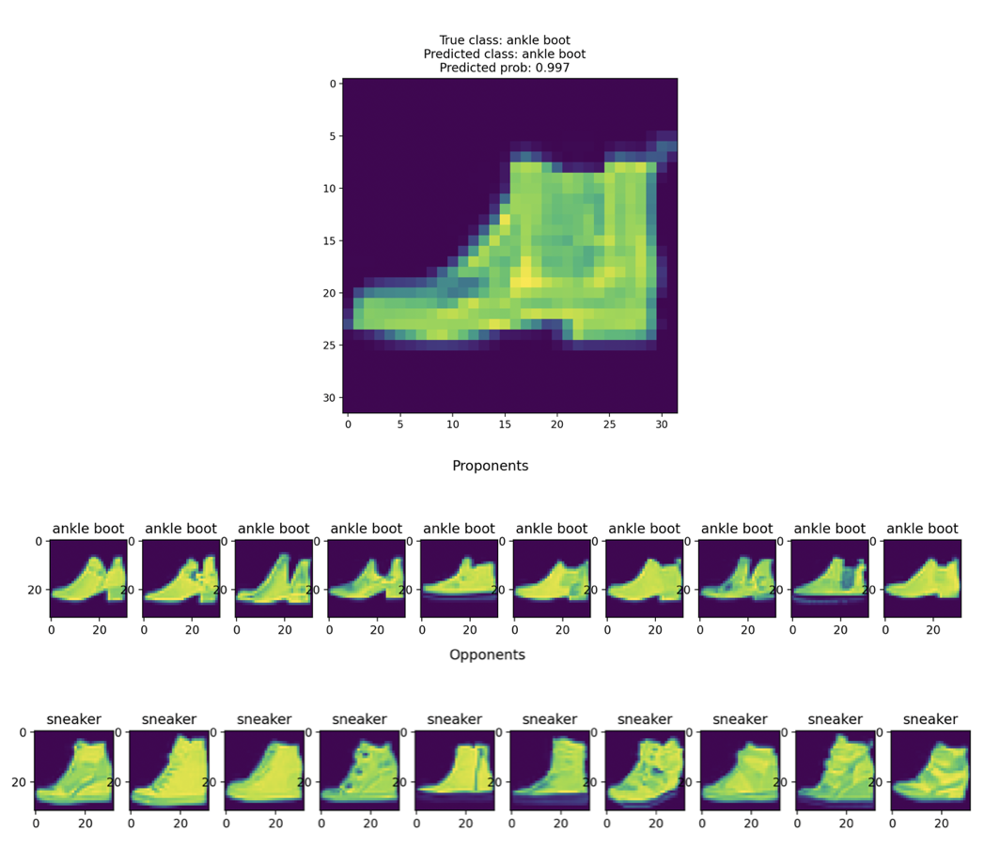

# Influential Examples Algorithm Evaluation

## Overview

Explainable AI can be defined as the set of methods that enable human users to understand and trust the results and outputs created by machine learning algorithms. In this context, there is a class of algorithms that aims to explain model decisions in terms of the data on which the models have been trained. This type of explanation can be called *example-level explanation*, and the training examples that influence a given decision are called *influential examples*.

In this repo, I perform a series of evaluation on an *influential examples* algorithm called `TracInCP`, implemented in the [Captum](https://captum.ai/) library for PyTorch.

Three models are evaluated: a logistic regression, a multilayer perceptron, and a convolutional neural network. They can be found in `models.py`.

The evaluations are performed on two standard datasets: [FashionMNIST](https://github.com/zalandoresearch/fashion-mnist) and [CIFAR-10](https://www.cs.toronto.edu/~kriz/cifar.html).

## Types of Evaluation

### 1. Qualitative evaluation

One of the three models is trained on one of the two dataset and the `TracInCP` algorithm is used to show influential training examples on one randomly sampled test image.

The following is an example result training the CNN on FashionMNIST:



*Proponents* are influential examples that "help" the model predict the right class, whereas *Opponents* are influential examples that "favor" wrong predictions.

In the result image, images of class *sneaker* that are somehow similar to the test image are *Proponents*. Instead, images of a wrong class (*sandal*) that are somehow similar to the test image are *Opponents*.

### 2. Self-influence evaluation

This evaluation consists of identifying mislabeled examples in the training data using *self-influence scores*. The self-influence score of a training point $x$ is the influence score that $x$ has on itself. Since mislabeled examples are usually outliers, they are likely to be very influential for themselves.

This evaluation has been tested for many influence algorithms, and it can be decomposed in the following steps:

1. Artificially mislabel a fraction of examples from the training set, i.e. 10%, to create a noisy training set.

2. Train a model on the noisy training set.

3. Compute the self-influence score for each training example and rank training points by decreasing self-influence score. 

4. Compute the AUC score of the ROC curve from using self-influence scores to identify mislabeled examples.

The following are the AUC score and ROC curve for the CNN trained on CIFAR-10:


### 3. Synthetic label noise evaluation

This evaluation consists of computing the average percentage of noisy influential examples across the whole test set for increasing amounts of mislabeled training examples.

The previous evaluation shows that mislabeled examples are highly influential for themselves, instead this evaluation answers the question "For increasing amounts of noise in the data, do mislabeled examples tend to be more influential than clean ones?".

The evaluation follows these steps:

1. Artificially mislabel a fraction of examples from the training set to create a noisy training set.

2. Train a model on the noisy training set.

3. For every example in the test set, compute the percentage of mislabeled influential examples among the top $k$ influential examples. Here $k$ is set to 10 (10 *proponents* + 10 *opponents*).

4. Compute the average percentage across the test set

5. Repeat 1-4 for incrasing fractions of mislabeled examples. Here I use 5%, 10% and 20%.

The following are the average percentages of mislabeled influential examples for the CNN trained on CIFAR-10:


## Installation

The code was developed using Python 3.8. To install the dependencies, run the following at the repo root:

```
$ python -m venv venv
$ source venv/bin/activate
$ pip install -r requirements.txt
```

## Run Evaluations

In order to perform an evaluation, run:

```
$ python --dataset <DATASET> --model_type <MODEL_TYPE> --eval_type <EVAL_TYPE> --device <DEVICE>
```

where:

`<DATASET>` : {`fashion-mnist`, `cifar10`}

`<MODEL_TYPE>` : {`lr`, `mlp`, `cnn`}

`<EVAL_TYPE>` : {`sample_influence`, `self_influence`, `label_noise`}

`<DEVICE>` : {`cuda`, `cpu`, `mps`}

## Results

The results for evaluation 2. and 3. are available in the folder `results`. Since evaluation 1. is qualitative, only examples for the CNN are available.
